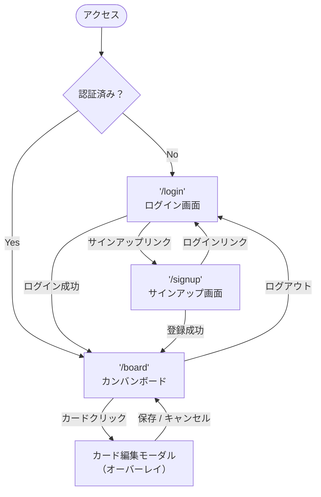

# 要件定義書 — Trello風タスク管理アプリ

**バージョン**: 1.0  
**作成日**: 2026-04-29  
**ステータス**: ドラフト

---

## 1. プロジェクト概要

### アプリ名（仮）
**TaskFlow**（後で変更可）

### 目的
カンバンボード形式でタスクを視覚的に管理できるWebアプリ。Trelloのようにカード（タスク）をカラム（状態）間でドラッグして進捗を管理できる。

### 対象ユーザー
- 個人でタスクを管理したい方
- 開発者・フリーランスなど

---

## 2. 機能要件

### 2-1. ユーザー認証

| # | 機能 | 詳細 |
|---|------|------|
| F01 | サインアップ | メールアドレス＋パスワードで新規登録 |
| F02 | ログイン | メールアドレス＋パスワードで認証 |
| F03 | ログアウト | セッションを終了してログイン画面に戻る |
| F04 | 認証保護 | 未ログイン状態ではボードにアクセス不可 |

### 2-2. カンバンボード

| # | 機能 | 詳細 |
|---|------|------|
| F05 | カラム表示 | ボード上に複数のカラムを横並びで表示 |
| F06 | カラム追加 | 新しいカラム（例: "レビュー中"）を作成 |
| F07 | カラム削除 | カラムを削除（中のカードも削除） |
| F08 | カード表示 | 各カラム内にタスクカードを一覧表示 |
| F09 | カード追加 | カラム内に新しいタスクを追加 |
| F10 | カード削除 | タスクを削除 |
| F11 | ドラッグ＆ドロップ | カードをドラッグして別カラムに移動 |
| F12 | カードタイトル編集 | カードをクリックしてモーダルを開き、タイトルを変更・保存できる |
| F13 | カラム名変更 | カラム名をクリックしてインラインで編集・確定できる |
| F14 | カードタグ設定 | カードにテキストタグを複数設定・削除できる。タグはカード一覧に表示される |

### 2-3. 初期カラム構成（デフォルト）

新規ユーザーのボードには以下の3カラムをデフォルトで作成する:

1. **Todo**（未着手）
2. **In Progress**（進行中）
3. **Done**（完了）

---

## 3. 非機能要件

| # | 項目 | 要件 |
|---|------|------|
| NF01 | レスポンシブ | PC・タブレット・スマホに対応 |
| NF02 | セキュリティ | 自分のデータのみ閲覧・編集可能（他ユーザーのデータは見えない） |
| NF03 | データ永続化 | ブラウザを閉じてもデータが保持される |
| NF04 | パフォーマンス | ドラッグ操作が滑らかに動作する |

---

## 4. 技術スタック

| カテゴリ | 技術 | 理由 |
|----------|------|------|
| フレームワーク | Next.js 14 (App Router) | フロント＋APIを1プロジェクトで管理。デプロイが簡単。 |
| 言語 | TypeScript | 型安全にコードを書けるため、バグを早期発見できる |
| スタイリング | Tailwind CSS | クラス名でUIを素早く組める |
| ドラッグ＆ドロップ | dnd-kit | モダンで使いやすいD&Dライブラリ |
| 認証・DB | Supabase | 無料枠あり。認証＋PostgreSQLをホスト不要で使える |

---

## 5. データ設計

### ER図（概念）

```
auth.users (Supabaseが管理)
    │
    │ 1:N
    ▼
columns
    │
    │ 1:N
    ▼
cards
```

### テーブル定義

#### `columns` テーブル

| カラム名 | 型 | 説明 |
|----------|----|------|
| id | uuid (PK) | カラムの一意ID |
| user_id | uuid (FK → auth.users) | 所有ユーザーのID |
| name | text | カラム名（例: "Todo"） |
| position | int | 表示順（0始まり） |
| created_at | timestamptz | 作成日時 |
| updated_at | timestamptz | 最終更新日時 |

#### `cards` テーブル

| カラム名 | 型 | 説明 |
|----------|----|------|
| id | uuid (PK) | カードの一意ID |
| column_id | uuid (FK → columns.id) | 所属するカラムのID |
| title | text | タスクのタイトル |
| position | int | カラム内の表示順（0始まり） |
| created_at | timestamptz | 作成日時 |
| updated_at | timestamptz | 最終更新日時 |

#### `card_tags` テーブル

| カラム名 | 型 | 説明 |
|----------|----|------|
| id | uuid (PK) | タグの一意ID |
| card_id | uuid (FK → cards.id) | 紐づくカードのID |
| name | text | タグ名（例: "バグ", "重要"） |
| color | text | タグの表示色（例: "#ef4444"）。省略可 |
| created_at | timestamptz | 作成日時 |

**削除の連鎖:** `columns` 削除時、紐づく `cards` は `ON DELETE CASCADE` で自動削除。`cards` 削除時、紐づく `card_tags` も `ON DELETE CASCADE` で自動削除。

**セキュリティ:** Supabase の Row Level Security（RLS）を有効化し、`columns.user_id = auth.uid()` の行のみ操作可能とする。`cards` はカラム経由で同一ユーザーのみアクセス可能。

---

## 6. 画面設計（ワイヤーフレーム）

### 画面1: ログイン画面 (`/login`)

**仕様:**
- 未認証でボードにアクセスした場合はこの画面にリダイレクト
- バリデーション: メールアドレス形式チェック・必須入力チェック（フォーム送信時）
- 認証失敗時はエラーメッセージをフォーム下部に表示
- 「アカウントをお持ちでない方はこちら」リンクで `/signup` へ遷移

```
┌─────────────────────────────────────┐
│                                     │
│           TaskFlow                  │
│                                     │
│  メールアドレス                      │
│  ┌─────────────────────────────┐   │
│  │                             │   │
│  └─────────────────────────────┘   │
│  パスワード                          │
│  ┌─────────────────────────────┐   │
│  │                             │   │
│  └─────────────────────────────┘   │
│                                     │
│  ❌ メールまたはパスワードが正しく   │
│     ありません（エラー時のみ表示）   │
│                                     │
│  [ ログイン ]                        │
│                                     │
│  アカウントをお持ちでない方はこちら  │
│                                     │
└─────────────────────────────────────┘
```

### 画面2: サインアップ画面 (`/signup`)

**仕様:**
- パスワード確認入力あり（2つの入力値が一致しているかチェック）
- バリデーション: メールアドレス形式・パスワード8文字以上・パスワード一致
- 登録成功後は `/board` に自動遷移（初期カラム3つを自動生成）
- 「すでにアカウントをお持ちの方はこちら」リンクで `/login` へ遷移

```
┌─────────────────────────────────────┐
│                                     │
│           TaskFlow                  │
│         アカウント作成               │
│                                     │
│  メールアドレス                      │
│  ┌─────────────────────────────┐   │
│  │                             │   │
│  └─────────────────────────────┘   │
│  パスワード（8文字以上）              │
│  ┌─────────────────────────────┐   │
│  │                             │   │
│  └─────────────────────────────┘   │
│  パスワード（確認）                   │
│  ┌─────────────────────────────┐   │
│  │                             │   │
│  └─────────────────────────────┘   │
│                                     │
│  ❌ エラーメッセージ（エラー時のみ） │
│                                     │
│  [ サインアップ ]                    │
│                                     │
│  すでにアカウントをお持ちの方はこちら │
│                                     │
└─────────────────────────────────────┘
```

### 画面3: カンバンボード画面 (`/board`)

**仕様:**
- ヘッダー右側のユーザーメニュー `[user@example.com ▼]` クリックでドロップダウン表示（ログアウトのみ）
- カラム名をクリックするとインライン編集モードに切り替わる（F13）
- カードをクリックすると編集モーダルが開く（F12）
- カードが0件のカラムには「タスクはありません」の空状態テキストを表示
- カラム削除時は確認ダイアログを表示（「このカラムを削除すると中のカードもすべて削除されます」）

```
┌────────────────────────────────────────────────────────┐
│ TaskFlow                          [user@example.com ▼] │
│                                   └─[ログアウト]───────┘│
├────────────────────────────────────────────────────────┤
│                                                        │
│  ┌────────────────┐ ┌──────────────┐ ┌────────────┐   │
│  │ [Todo      ✎]×│ │[In Progress]×│ │ [Done    ]×│   │
│  │  ↑カラム名     │ │              │ │            │   │
│  │  クリックで    │ ├──────────────┤ ├────────────┤   │
│  │  インライン編集│ │ ┌──────────┐ │ │ ┌────────┐ │   │
│  ├────────────────┤ │ │ タスクC  │ │ │ │タスクE │ │   │
│  │ ┌──────────┐  │ │ │🔵 重要   │ │ │ └────────┘ │   │
│  │ │ タスクA  │  │ │ └──────────┘ │ │            │   │
│  │ │🔴 バグ   │  │ │              │ │            │   │
│  │ └──────────┘  │ │ タスクなし   │ │            │   │
│  │ ┌──────────┐  │ │              │ │            │   │
│  │ │ タスクB  │  │ │              │ │            │   │
│  │ └──────────┘  │ │              │ │            │   │
│  │               │ │              │ │            │   │
│  │ [+ カード追加] │ │[+ カード追加]│ │[+カード追加]│   │
│  └────────────────┘ └──────────────┘ └────────────┘   │
│                                      [+ カラム追加]    │
└────────────────────────────────────────────────────────┘
```

### 画面4: カード編集モーダル

**仕様:**
- カードクリックで画面上にオーバーレイ表示
- タイトルを編集して「保存」ボタンで確定、「キャンセル」または `×` で閉じる
- 背景クリックでも閉じる（変更は破棄）

```
┌────────────────────────────────────────────────────────┐
│ (背景はボード画面が薄暗くなる)                          │
│                                                        │
│         ┌──────────────────────────────┐              │
│         │  カードを編集          [×]  │              │
│         ├──────────────────────────────┤              │
│         │                              │              │
│         │  タイトル                    │              │
│         │  ┌────────────────────────┐  │              │
│         │  │ タスクA               │  │              │
│         │  └────────────────────────┘  │              │
│         │                              │              │
│         │  タグ                        │              │
│         │  [🔴 バグ ×] [🔵 重要 ×]   │              │
│         │  ┌──────────────┐ [+ 追加]  │              │
│         │  │ タグ名を入力 │           │              │
│         │  └──────────────┘           │              │
│         │                              │              │
│         │  [ キャンセル ]  [ 保存 ]    │              │
│         │                              │              │
│         └──────────────────────────────┘              │
│                                                        │
└────────────────────────────────────────────────────────┘
```

---

## 7. 画面遷移図



---

## 8. ユースケース図


---

## 9. 開発フェーズ（参考）

| フェーズ | 内容 | 主な成果物 |
|----------|------|------------|
| Phase 1 | プロジェクトセットアップ | Next.js初期化、Supabase接続設定 |
| Phase 2 | ユーザー認証 | ログイン・サインアップ画面、認証ルーティング |
| Phase 3 | カンバンUI | カラム・カードの表示・追加・削除 |
| Phase 4 | Supabase連携 | データの取得・保存・リアルタイム更新 |
| Phase 5 | ドラッグ＆ドロップ | dnd-kitを使ったカード移動機能 |
| Phase 6 | スタイリング・レスポンシブ | モバイル対応、UI仕上げ |
| Phase 7 | テスト・デプロイ | 動作確認、Vercelへのデプロイ |

---

## 10. スコープ外（今回は実装しない）

- カードの詳細説明・コメント機能（タイトル編集のみ実装）
- 複数ボードの管理
- チームメンバーとの共有・コラボレーション
- 期限日・優先度設定
- 通知機能
- カラムのドラッグ&ドロップによる並び替え
