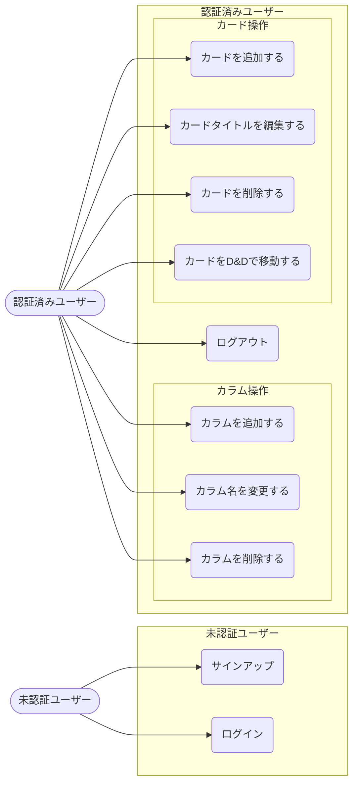

# 要件定義書 — Trello風タスク管理アプリ

**バージョン**: 1.2  
**作成日**: 2026-04-29  
**更新日**: 2026-05-04  
**ステータス**: ドラフト

---

## 1. プロジェクト概要

### アプリ名（仮）
**TaskFlow**（後で変更可）

### 目的
カンバンボード形式でタスクを視覚的に管理できるWebアプリ。Trelloのようにカード（タスク）をカラム（状態）間でドラッグして進捗を管理できる。

### 対象ユーザー
- 個人でタスクを管理したい方
- 開発者・フリーランスなど

---

## 2. 機能要件

### 2-1. ユーザー認証

| # | 機能 | 詳細 |
|---|------|------|
| F01 | サインアップ | メールアドレス＋パスワードで新規登録 |
| F02 | ログイン | メールアドレス＋パスワードで認証 |
| F03 | ログアウト | セッションを終了してログイン画面に戻る |
| F04 | 認証保護 | 未ログイン状態ではボードにアクセス不可 |

### 2-2. カンバンボード

| # | 機能 | 詳細 |
|---|------|------|
| F05 | カラム表示 | ボード上に複数のカラムを横並びで表示 |
| F06 | カラム追加 | 新しいカラム（例: "レビュー中"）を作成 |
| F07 | カラム削除 | カラムを削除（中のカードも削除） |
| F08 | カード表示 | 各カラム内にタスクカードを一覧表示 |
| F09 | カード追加 | カラム内に新しいタスクを追加する。タイトル入力と同時にタグも設定可能 |
| F10 | カード削除 | タスクを削除 |
| F11 | ドラッグ＆ドロップ | カードをドラッグして別カラムに移動 |
| F12 | カードタイトル編集 | カードをクリックしてモーダルを開き、タイトルを変更・保存できる |
| F13 | カラム名変更 | カラム名をクリックしてインラインで編集・確定できる |
| F14 | カードタグ設定 | カードにテキストタグを複数設定できる。タグはボード全体で共有され、既存タグをクリックで選択・解除できる。新規タグを作成するとボード全体で再利用可能になる。タグはカード一覧にも表示される |
| F15 | カード期限設定 | カードに任意で期限日を設定できる。カード一覧に期限日を表示し、超過・当日・3日以内・それ以降で色分けする。カード追加時にも設定可能 |

### 2-3. 初期カラム構成（デフォルト）

新規ユーザーのボードには以下の3カラムをデフォルトで作成する:

1. **Todo**（未着手）
2. **In Progress**（進行中）
3. **Done**（完了）

---

## 3. 非機能要件

| # | 項目 | 要件 |
|---|------|------|
| NF01 | レスポンシブ | PC・タブレット・スマホに対応 |
| NF02 | セキュリティ | 自分のデータのみ閲覧・編集可能（他ユーザーのデータは見えない） |
| NF03 | データ永続化 | ブラウザを閉じてもデータが保持される |
| NF04 | パフォーマンス | ドラッグ操作が滑らかに動作する |

---

## 4. 技術スタック

→ 詳細は [技術スタック定義書](techstack.md) を参照。

| カテゴリ | 技術 |
|----------|------|
| バックエンド | Spring Boot 4.0.x (Java 25) + Gradle |
| API | REST API + OpenAPI 3.0 (Swagger UI) |
| 認証 | Spring Security + JWT |
| フロントエンド | React 18 + TypeScript + Vite |
| スタイリング | Tailwind CSS |
| ドラッグ＆ドロップ | dnd-kit |
| データベース | PostgreSQL |

---

## 5. データ設計

→ 詳細は [DB設計書](database-design.md) を参照。

**テーブル構成:**
- `columns` — ユーザーごとのカラム（状態）
- `cards` — カラムに紐づくタスクカード
- `card_tags` — カードに付与するタグ

RLS（Row Level Security）により、各ユーザーは自分のデータのみ操作可能。

---

## 6. 画面設計

→ 詳細は [画面設計書](screen-design.md) を参照。

**画面一覧:**

| 画面名 | パス |
|--------|------|
| ログイン画面 | `/login` |
| サインアップ画面 | `/signup` |
| カンバンボード画面 | `/board` |
| カード編集モーダル | — |

---

## 7. ユースケース図

---

## 8. スコープ外（今回は実装しない）

- カードの詳細説明・コメント機能（タイトル編集のみ実装）
- 複数ボードの管理
- チームメンバーとの共有・コラボレーション
- 優先度設定
- 通知機能
- カラムのドラッグ&ドロップによる並び替え
