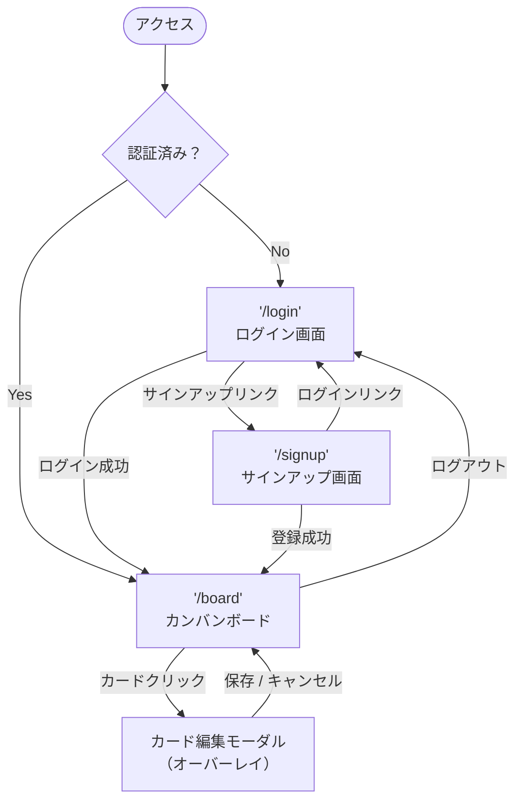

# 画面設計書 — Trello風タスク管理アプリ

**バージョン**: 1.2  
**作成日**: 2026-04-29  
**更新日**: 2026-05-04

---

## 1. 画面一覧

| 画面名 | パス | 概要 |
|--------|------|------|
| ログイン画面 | `/login` | メール+パスワード認証 |
| サインアップ画面 | `/signup` | 新規アカウント作成 |
| カンバンボード画面 | `/board` | メインのタスク管理画面 |
| カード編集モーダル | — | ボード画面上のオーバーレイ |

---

## 2. 各画面の仕様

### 画面1: ログイン画面 (`/login`)

**仕様:**
- 未認証でボードにアクセスした場合はこの画面にリダイレクト
- バリデーション: メールアドレス形式チェック・必須入力チェック（フォーム送信時）
- 認証失敗時はエラーメッセージをフォーム下部に表示
- 「アカウントをお持ちでない方はこちら」リンクで `/signup` へ遷移

```
┌─────────────────────────────────────┐
│                                     │
│           TaskFlow                  │
│                                     │
│  メールアドレス                      │
│  ┌─────────────────────────────┐   │
│  │                             │   │
│  └─────────────────────────────┘   │
│  パスワード                          │
│  ┌─────────────────────────────┐   │
│  │                             │   │
│  └─────────────────────────────┘   │
│                                     │
│  ❌ メールまたはパスワードが正しく   │
│     ありません（エラー時のみ表示）   │
│                                     │
│  [ ログイン ]                        │
│                                     │
│  アカウントをお持ちでない方はこちら  │
│                                     │
└─────────────────────────────────────┘
```

---

### 画面2: サインアップ画面 (`/signup`)

**仕様:**
- パスワード確認入力あり（2つの入力値が一致しているかチェック）
- バリデーション: メールアドレス形式・パスワード8文字以上・パスワード一致
- 登録成功後は `/board` に自動遷移（初期カラム3つを自動生成）
- 「すでにアカウントをお持ちの方はこちら」リンクで `/login` へ遷移

```
┌─────────────────────────────────────┐
│                                     │
│           TaskFlow                  │
│         アカウント作成               │
│                                     │
│  メールアドレス                      │
│  ┌─────────────────────────────┐   │
│  │                             │   │
│  └─────────────────────────────┘   │
│  パスワード（8文字以上）              │
│  ┌─────────────────────────────┐   │
│  │                             │   │
│  └─────────────────────────────┘   │
│  パスワード（確認）                   │
│  ┌─────────────────────────────┐   │
│  │                             │   │
│  └─────────────────────────────┘   │
│                                     │
│  ❌ エラーメッセージ（エラー時のみ） │
│                                     │
│  [ サインアップ ]                    │
│                                     │
│  すでにアカウントをお持ちの方はこちら │
│                                     │
└─────────────────────────────────────┘
```

---

### 画面3: カンバンボード画面 (`/board`)

**仕様:**
- ヘッダー右側のユーザーメニュー `[user@example.com ▼]` クリックでドロップダウン表示（ログアウトのみ）
- カラム名をクリックするとインライン編集モードに切り替わる（F13）
- カードをクリックすると編集モーダルが開く（F12）
- カードが0件のカラムには「タスクはありません」の空状態テキストを表示
- カラム削除時は確認ダイアログを表示（「このカラムを削除すると中のカードもすべて削除されます」）
- 「＋ カード追加」をクリックするとフォームが展開され、タイトル入力と同時にタグを設定できる（F09）

```
┌────────────────────────────────────────────────────────┐
│ TaskFlow                          [user@example.com ▼] │
│                                   └─[ログアウト]───────┘│
├────────────────────────────────────────────────────────┤
│                                                        │
│  ┌────────────────┐ ┌──────────────┐ ┌────────────┐   │
│  │ [Todo      ✎]×│ │[In Progress]×│ │ [Done    ]×│   │
│  │  ↑カラム名     │ │              │ │            │   │
│  │  クリックで    │ ├──────────────┤ ├────────────┤   │
│  │  インライン編集│ │ ┌──────────┐ │ │ ┌────────┐ │   │
│  ├────────────────┤ │ │ タスクC  │ │ │ │タスクE │ │   │
│  │ ┌──────────┐  │ │ │🔵 重要   │ │ │ └────────┘ │   │
│  │ │ タスクA  │  │ │ └──────────┘ │ │            │   │
│  │ │🔴 バグ   │  │ │              │ │            │   │
│  │ └──────────┘  │ │ タスクなし   │ │            │   │
│  │ ┌──────────┐  │ │              │ │            │   │
│  │ │ タスクB  │  │ │              │ │            │   │
│  │ └──────────┘  │ │              │ │            │   │
│  │               │ │              │ │            │   │
│  │ [+ カード追加] │ │[+ カード追加]│ │[+カード追加]│   │
│  └────────────────┘ └──────────────┘ └────────────┘   │
│                                      [+ カラム追加]    │
└────────────────────────────────────────────────────────┘
```

**カード追加フォーム（展開状態）:**

「＋ カード追加」クリックで下記のフォームがカラム内に展開される。

```
│  ┌──────────────────────────────┐  │
│  │ タスクのタイトルを入力…      │  │
│  │                              │  │
│  └──────────────────────────────┘  │
│  [バグ] [重要] [バックエンド] [＋新規]│
│    ↑ 既存タグ（クリックでON/OFF）   │
│  期限日: [____年__月__日        ]   │
│  [ カードを追加 ]  [✕]             │
```

---

### 画面4: カード編集モーダル

**仕様:**
- カードクリックで画面上にオーバーレイ表示
- タイトルを編集して「保存」ボタンで確定、「キャンセル」または `×` で閉じる
- 背景クリックでも閉じる（変更は破棄）
- タグはボード全体で共有される既存タグ一覧から選択（クリックでON/OFF）
- 「＋ 新規タグ」入力欄で新しいタグを作成するとボード全体に追加される
- 期限日は任意入力。「クリア」で削除可能

```
┌────────────────────────────────────────────────────────┐
│ (背景はボード画面が薄暗くなる)                          │
│                                                        │
│         ┌──────────────────────────────┐              │
│         │  カードを編集          [×]  │              │
│         ├──────────────────────────────┤              │
│         │                              │              │
│         │  タイトル                    │              │
│         │  ┌────────────────────────┐  │              │
│         │  │ タスクA               │  │              │
│         │  └────────────────────────┘  │              │
│         │                              │              │
│         │  期限日                      │              │
│         │  ┌──────────────────┐[クリア]│              │
│         │  │ ____年__月__日   │       │              │
│         │  └──────────────────┘       │              │
│         │                              │              │
│         │  タグ                        │              │
│         │  ┌────────────────────────┐  │              │
│         │  │[🔴バグ✓] [🔵重要] [📗バックエンド]│  │              │
│         │  │  ↑ 既存タグ（選択中=枠線あり）   │  │              │
│         │  └────────────────────────┘  │              │
│         │  ┌────────────────┐[+新規タグ]│              │
│         │  │ 新しいタグ名   │          │              │
│         │  └────────────────┘          │              │
│         │                              │              │
│         │  [ キャンセル ]  [ 保存 ]    │              │
│         │                              │              │
│         └──────────────────────────────┘              │
│                                                        │
└────────────────────────────────────────────────────────┘
```

---

## 3. 画面遷移図


